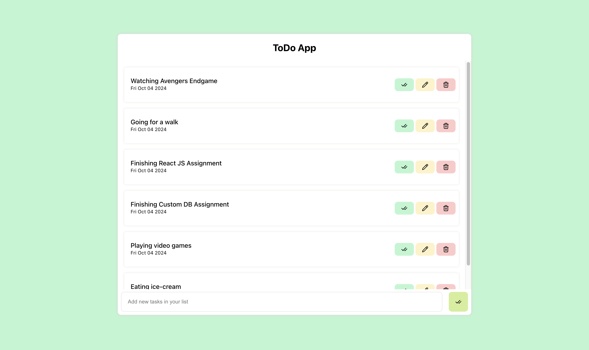
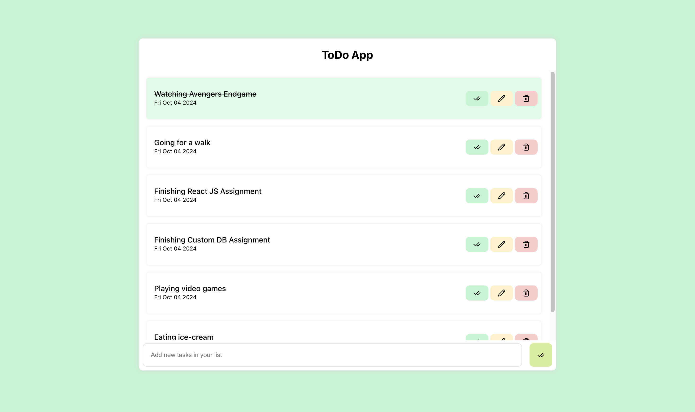
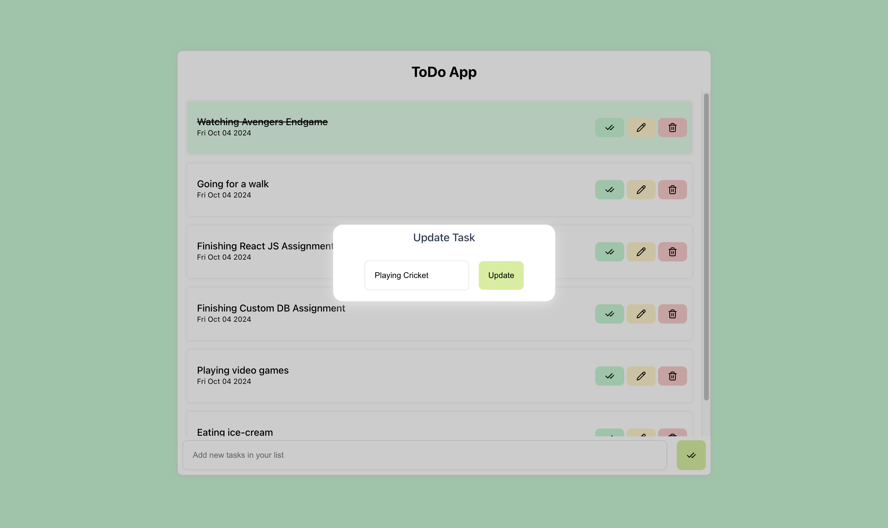
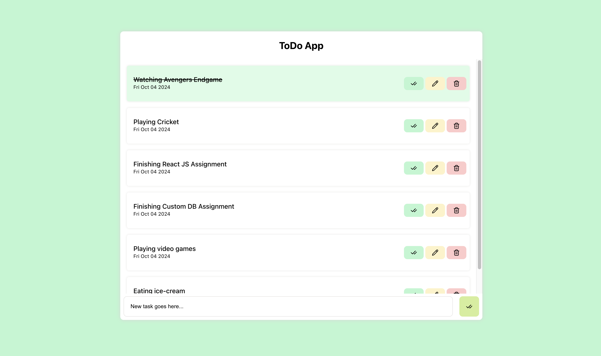
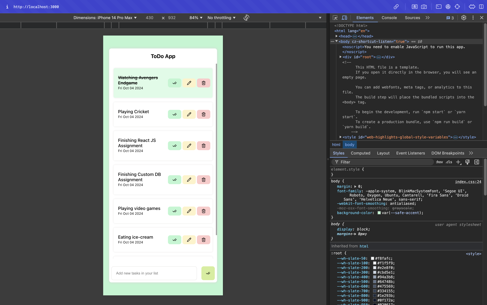

# React To Do App

This project aims to create a TODO Application called Todoist in React JS. The primitive objectives are covered below.

## Overview

Showcasing Todoist, a React JS based TODO management app. Now write your tasks, mark them as complete, unmark them from their completion, delete or update them.

Managing tasks was never simpler before this minimalist todo application.

## Table Of Contents

[1. Features](#features)

[2. Installation](#installation)

[3. Running Locally](#running-locally)

[4. Environment Variables](#environment-variables)

[5. Usage Instructions](#usage-instructions)

[6. Usage Snippets](#usage-snippets)

[7. Appendix](#appendix)

## Features

- Create a task.
- Remove a task.
- Edit the task when required.
- Mark the task as done.
- Tasks are now persisted with local storage.
- Memoisation has been implemented at appropriate places.
- Several UI optimizations are made.
- Responsive layouts for devices of all types.

## Installation

### Pre-requisites

- Download Node JS.
- Download NPM.

### Steps

**Step 1:** Clone this repo.

**Step 2:** Navigate to the feature/react-assignment branch.

**Step 3:** Run npm install to install the dependencies.

**Step 4:** Run npm run start to start the development server on localhost.

**Step 5:** Run npm run build to start the production build.

## Running Locally

- Follow the steps above to run locally.

## Environment Variables

No extra environment variables were used in this project.

## Usage Instructions

1. Follow the instructions mentioned in running locally section above.

## Usage Snippets

## Appendix

The project adheres to all the developmental guidelines and has implemented all the known issues mentioned in the assignment.

In case of any inaccuracy, reach out to the author of this repo at yogesh.bhutkar@rtcamp.com